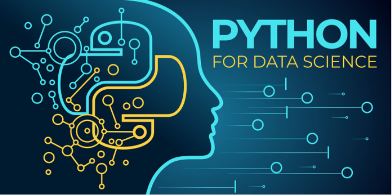

## 🔧 Technologies & Tools

# Python Basics for Data Science
This repository contains the basics of python programming i.e., String, Operators, Comments, Variables, Type Conversion, Conditional Statements, Functions, Loops, Indexes, Data Structures with simple and practical examples

1.	String
2.	Operators
3.	Comments
4.	Variables
5.	Input Variables
6.	Logical Operators
7.	Type Conversion
8.	IF, ELSE & ELIF Statements
9.	Functions
10.	Loops
11.	Import Libraries
12.	Indexing
13.	Basic Data Structures in Python
